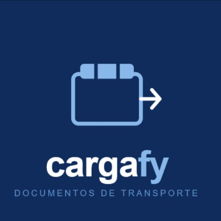
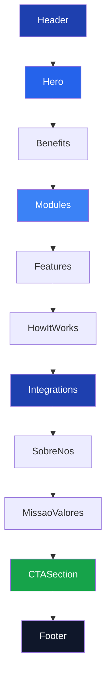

<p align="center">
  
</p>

<h1 align="center">CargaFy — Landing Page Comercial</h1>

<p align="center">
  <strong>Landing page de alta performance para a plataforma de emissão fiscal de transporte mais rápida do Brasil.</strong>
</p>

<p align="center">
  
  
  
  
  
</p>

<p align="center">
  <a href="https://cargafy.com.br" target="_blank">🌐 cargafy.com.br</a> ·
  <a href="https://wa.me/5511994599115" target="_blank">💬 WhatsApp SP</a> ·
  <a href="https://wa.me/5549982666688" target="_blank">💬 WhatsApp SC</a> ·
  <a href="mailto:contato@cargafy.com.br">📧 contato@cargafy.com.br</a>
</p>

---

## 📋 Índice

- [Sobre o Projeto](#-sobre-o-projeto)
- [Funcionalidades](#-funcionalidades)
- [Tech Stack](#-tech-stack)
- [Arquitetura](#-arquitetura)
- [Estrutura de Pastas](#-estrutura-de-pastas)
- [Componentes](#-componentes)
- [Design System](#-design-system)
- [SEO & Performance](#-seo--performance)
- [Começando](#-começando)
- [Scripts Disponíveis](#-scripts-disponíveis)
- [Deploy](#-deploy)
- [Fundadores](#-fundadores)
- [Licença](#-licença)

---

## 🚀 Sobre o Projeto

A **CargaFy** é uma plataforma de emissão fiscal especializada em transporte rodoviário de cargas. Esta landing page foi construída com foco em **conversão**, **SEO técnico** e **performance extrema**, servindo como porta de entrada para transportadoras que buscam emitir CT-e, MDF-e e gerar CIOT de forma rápida, segura e automatizada.

### O que é a CargaFy?

| Módulo | Descrição |
|--------|-----------|
| **CT-e** | Conhecimento de Transporte Eletrônico — emissão unitária e em lote, cancelamento, inutilização, carta de correção e DACTE automático |
| **MDF-e** | Manifesto Eletrônico de Documentos Fiscais — abertura, encerramento, inclusão de DF-e vinculados e DAMDFE automático |
| **CIOT** | Código Identificador da Operação de Transporte — geração automática integrada ao fluxo, controle de pagamento e encerramento |

---

## ✨ Funcionalidades

- 🎨 **Dark Mode First** — Design otimizado para modo escuro com suporte a light mode via `next-themes`
- ⚡ **Performance** — Score 95+ no Lighthouse com imagens em AVIF/WebP e fontes otimizadas
- 🔍 **SEO Avançado** — Structured Data (JSON-LD), Open Graph, Twitter Cards, sitemap.xml e robots.txt dinâmicos
- 📱 **Totalmente Responsivo** — Layout adaptativo com breakpoints otimizados para mobile, tablet e desktop
- 🎭 **Micro-animações** — Scroll reveal, hover effects com glow cards, gradient text e animações de entrada
- 🪟 **Glassmorphism** — Efeitos de vidro fosco no header com backdrop blur
- 🏗️ **Arquitetura Modular** — 16 componentes independentes e reutilizáveis
- 🔗 **Integração WhatsApp** — CTAs diretos para conversão via WhatsApp (SP e SC)

---

## 🛠️ Tech Stack

| Tecnologia | Versão | Propósito |
|------------|--------|-----------|
| [Next.js](https://nextjs.org/) | `15.3` | Framework React com App Router e SSR |
| [React](https://react.dev/) | `19.0` | Biblioteca UI com Server Components |
| [TypeScript](https://typescriptlang.org/) | `5.7` | Tipagem estática e segurança de código |
| [TailwindCSS](https://tailwindcss.com/) | `4.1` | Utility-first CSS com design tokens customizados |
| [next-themes](https://github.com/pacocoursey/next-themes) | `0.4` | Gerenciamento de tema dark/light |
| [ESLint](https://eslint.org/) | `9.0` | Linting e padronização de código |

### Tipografia

| Fonte | Uso | Pesos |
|-------|-----|-------|
| [Sora](https://fonts.google.com/specimen/Sora) | Headings (`--font-heading`) | 300–800 |
| [DM Sans](https://fonts.google.com/specimen/DM+Sans) | Body text (`--font-body`) | 300–500 |

---

## 🏗️ Arquitetura

```
┌─────────────────────────────────────────────────┐
│                   Next.js 15                     │
│                  App Router                      │
├──────────────────┬──────────────────────────────┤
│   Layout (SSR)   │        Metadata API          │
│  ┌────────────┐  │  ┌────────────────────────┐  │
│  │ ThemeProvider│  │  │ JSON-LD / OG / Twitter │  │
│  │ Google Fonts│  │  │ robots.ts / sitemap.ts │  │
│  └────────────┘  │  └────────────────────────┘  │
├──────────────────┴──────────────────────────────┤
│                  Page (SSR)                       │
│  ┌────────────────────────────────────────────┐  │
│  │  Header → Hero → Benefits → Modules →      │  │
│  │  Features → HowItWorks → Integrations →    │  │
│  │  SobreNos → MissaoValores → CTA → Footer   │  │
│  └────────────────────────────────────────────┘  │
├──────────────────────────────────────────────────┤
│              TailwindCSS 4 + PostCSS              │
│         Custom Theme · Animations · Glow          │
└──────────────────────────────────────────────────┘
```

---

## 📁 Estrutura de Pastas

```
cargafy/
├── public/
│   ├── images/
│   │   ├── logo_cargafy.jpg        # Logo da marca
│   │   ├── marcos_profile.jpeg     # Foto fundador — Marcos
│   │   └── otavio_profile.jpg      # Foto fundador — Otávio
│   └── logo_cargafy.ico            # Favicon
├── src/
│   ├── app/
│   │   ├── globals.css             # Design system (tokens, animações, glassmorphism)
│   │   ├── layout.tsx              # Root layout com metadata, JSON-LD, fontes
│   │   ├── page.tsx                # Composição de todas as seções
│   │   ├── robots.ts               # Regras de crawling dinâmicas
│   │   └── sitemap.ts              # Sitemap XML dinâmico
│   └── components/
│       ├── Header.tsx              # Navegação glassmorphism com menu mobile
│       ├── Hero.tsx                # Seção principal com CTA e mockup
│       ├── Benefits.tsx            # Benefícios com ícones animados
│       ├── Modules.tsx             # Cards dos módulos CTe, MDFe, CIOT
│       ├── Features.tsx            # Lista de recursos + timeline de fluxo
│       ├── HowItWorks.tsx          # Passo a passo de onboarding
│       ├── Integrations.tsx        # Hub de integrações (SEFAZ, ERP, API)
│       ├── SobreNos.tsx            # Cards dos fundadores com fotos e skills
│       ├── MissaoValores.tsx       # Missão da empresa + grid de valores
│       ├── CTASection.tsx          # Call-to-action final com gradiente
│       ├── Testimonials.tsx        # Depoimentos (preparado para uso)
│       ├── Diferenciais.tsx        # Diferenciais competitivos
│       ├── MockupDashboard.tsx     # Mockup visual do dashboard
│       ├── ScrollReveal.tsx        # Wrapper para animações de scroll
│       ├── ThemeProvider.tsx       # Provider de tema dark/light
│       └── Footer.tsx              # Footer com links, contatos e redes sociais
├── next.config.ts                  # Config Next.js (AVIF/WebP, strict mode)
├── postcss.config.mjs              # PostCSS com plugin TailwindCSS 4
├── tsconfig.json                   # Config TypeScript com path aliases (@/*)
├── package.json                    # Dependências e scripts
└── .gitignore                      # Arquivos ignorados pelo Git
```

---

## 🧩 Componentes

### Fluxo da Página



### Detalhamento

| Componente | Tipo | Descrição |
|------------|------|-----------|
| `Header` | Client | Navbar com glassmorphism, scroll-aware, menu hamburger no mobile |
| `Hero` | Server | Headline principal, badge animado, CTAs, social proof, mockup dashboard |
| `Benefits` | Server | Grid de benefícios com ícones SVG e scroll reveal |
| `Modules` | Server | Cards dos 3 módulos (CTe, MDFe, CIOT) com glow hover e badges API |
| `Features` | Server | Checklist de recursos + timeline visual do fluxo de emissão |
| `HowItWorks` | Server | Steps de onboarding numerados com transição visual |
| `Integrations` | Server | Hub visual com SEFAZ, ERP, CIOT, APIs REST — CargaFy no centro |
| `SobreNos` | Server | Cards dos fundadores com fotos, roles e skill tags |
| `MissaoValores` | Server | Declaração de missão + grid de 4 valores com ícones |
| `CTASection` | Server | CTA final com gradiente bold para conversão |
| `MockupDashboard` | Server | Representação visual do dashboard da plataforma |
| `ScrollReveal` | Client | HOC com Intersection Observer para animações de entrada |
| `ThemeProvider` | Client | Wrapper do `next-themes` para toggle dark/light |
| `Footer` | Server | 4 colunas: brand, plataforma, empresa, legal + redes sociais |

---

## 🎨 Design System

### Paleta de Cores

```css
/* ─── Brand (Azul) ─── */
--color-brand-50:  #EFF6FF    --color-brand-500: #3B82F6
--color-brand-100: #DBEAFE    --color-brand-600: #2563EB
--color-brand-200: #BFDBFE    --color-brand-700: #1D4ED8
--color-brand-400: #60A5FA    --color-brand-800: #1E40AF
                               --color-brand-900: #1E3A8A

/* ─── Accent (Verde) ─── */
--color-accent-green:      #16A34A
--color-accent-green-light: #22C55E
--color-accent-green-soft:  #DCFCE7

/* ─── Módulos ─── */
--color-module-cte:  #3B82F6   /* Azul */
--color-module-mdfe: #F59E0B   /* Âmbar */
--color-module-ciot: #10B981   /* Esmeralda */

/* ─── Superfícies Dark ─── */
--color-surface-dark:            #030712
--color-surface-dark-secondary:  #0A0F1A
--color-surface-card-dark:       #111827
--color-surface-card-dark-hover: #1F2937
```

### Animações

| Nome | Duração | Uso |
|------|---------|-----|
| `fade-in` | 0.7s | Entrada da seção Hero |
| `float` | 6s (loop) | Elementos decorativos flutuantes |
| `pulse-dot` | 2s (loop) | Badge "Novo" no Hero |
| `glow` | 3s (loop) | Cards com brilho pulsante |
| `scroll-reveal` | 0.6s | Entrada ao scroll via Intersection Observer |

### Efeitos Especiais

| Efeito | Classe | Descrição |
|--------|--------|-----------|
| Glassmorphism | `.glass-light` / `.glass-dark` | Backdrop blur 16px com opacidade 85% |
| Gradient Text | `.gradient-text` | Texto com gradiente `brand-400 → brand-700` |
| Glow Cards | `.card-glow-*` | Box-shadow colorido no hover (blue, green, amber) |
| Custom Scrollbar | `.dark ::-webkit-scrollbar` | Scrollbar estilizada no dark mode |

---

## 🔍 SEO & Performance

### Otimizações Implementadas

- ✅ **Metadata API** do Next.js 15 com title template, description, keywords
- ✅ **Open Graph** completo com imagem 1200×630, locale `pt_BR`
- ✅ **Twitter Cards** com `summary_large_image`
- ✅ **JSON-LD** (Schema.org) — `SoftwareApplication` com `AggregateRating`, `ContactPoint` e `PostalAddress`
- ✅ **Canonical URL** — `https://cargafy.com.br`
- ✅ **robots.ts** dinâmico com sitemap reference
- ✅ **sitemap.ts** dinâmico para geração automática
- ✅ **Imagens** otimizadas via `next/image` com formatos AVIF e WebP
- ✅ **Fontes** com `display: swap` e `next/font/google` (zero CLS)
- ✅ **HTML Semântico** — `<main>`, `<section>`, `<nav>`, `<footer>`, `<header>`
- ✅ **Heading Hierarchy** — Um único `<h1>` por página
- ✅ **Lang attribute** — `pt-BR` no elemento `<html>`

### Structured Data (JSON-LD)

```json
{
  "@context": "https://schema.org",
  "@type": "SoftwareApplication",
  "name": "CargaFy",
  "applicationCategory": "BusinessApplication",
  "operatingSystem": "Web",
  "aggregateRating": {
    "ratingValue": "5.0",
    "reviewCount": "200"
  }
}
```

---

## 🏁 Começando

### Pré-requisitos

- **Node.js** ≥ 18.17
- **npm** ≥ 9.0 (ou pnpm/yarn)

### Instalação

```bash
# 1. Clone o repositório
git clone https://github.com/seu-usuario/cargafy.git
cd cargafy

# 2. Instale as dependências
npm install

# 3. Inicie o servidor de desenvolvimento
npm run dev
```

O servidor estará disponível em **[http://localhost:3000](http://localhost:3000)**.

### Variáveis de Ambiente

Nenhuma variável de ambiente é necessária para a landing page. Caso precise configurar a URL base para produção:

```env
# .env.local (opcional)
NEXT_PUBLIC_SITE_URL=https://cargafy.com.br
```

---

## 📜 Scripts Disponíveis

| Comando | Descrição |
|---------|-----------|
| `npm run dev` | Inicia o servidor de desenvolvimento com hot reload |
| `npm run build` | Gera a build de produção otimizada |
| `npm run start` | Inicia o servidor de produção |
| `npm run lint` | Executa o ESLint para análise de código |

---

## 🚢 Deploy

### Vercel (Recomendado)

```bash
# Via CLI
npx vercel --prod
```

Ou conecte o repositório diretamente no [dashboard da Vercel](https://vercel.com/new) para deploys automáticos a cada push.

### Outras Plataformas

A aplicação é compatível com qualquer plataforma que suporte Node.js:

```bash
# Build e start
npm run build
npm run start
```

---

## 👨‍💻 Fundadores

<table>
  <tr>
    <td align="center" width="50%">
      <br />
      <strong>Marcos Vinicius Angeli Costa</strong><br />
      <em>Engenheiro de Software Sênior</em><br /><br />
      Especialista em arquitetura de sistemas e soluções de alta performance. Apaixonado por simplificar processos complexos através da tecnologia.<br /><br />
      <code>Arquitetura de Software</code> · <code>APIs</code> · <code>Sistemas Fiscais</code> · <code>Sistemas Distribuídos</code>
    </td>
    <td align="center" width="50%">
      <br />
      <strong>Otávio Alexandre Ramos</strong><br />
      <em>Engenheiro de Software Especialista & Tech Lead</em><br /><br />
      Líder técnico com foco em escalabilidade e excelência de código. Experiência sólida em engenharia de produto e condução de equipes de alto nível.<br /><br />
      <code>Liderança Técnica</code> · <code>Escalabilidade</code> · <code>Engenharia de Produto</code> · <code>Segurança de Dados</code>
    </td>
  </tr>
</table>

---

## 📄 Licença

Este projeto é **proprietário** e de uso exclusivo da **CargaFy Tecnologia Ltda**.  
Todos os direitos reservados © 2025.

---

<p align="center">
  Feito com 💙 por <strong>CargaFy Tecnologia</strong> — São Caetano do Sul/SP & Lages/SC
</p>
